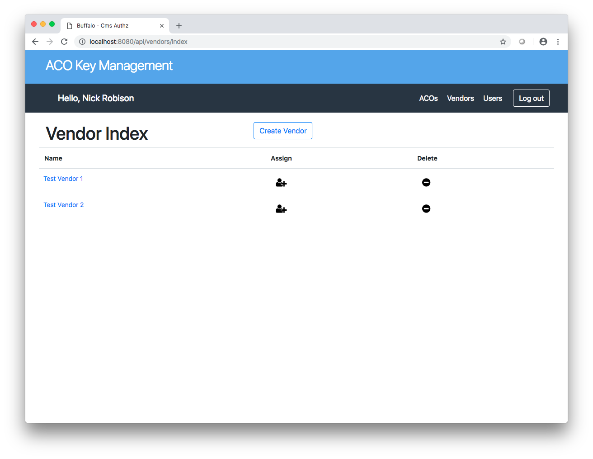

=========================
User Authentication Flows
=========================
:Date: 2019-01-18
:Version: 0.0.1
:Authors: - Nick Robison

This document outlines two example user authentication flows that illustrate various ways that macaroons can be used to handle user authentication and authorization.

The flows can be executed via the *cli* application, which allows the user to modify various parts of the authentication flow and view the various responses.
The build instructions are given in the main `README <../../README.md#cli-client>`_.

Dynamic Flow
============

The *dynamic* flow represents an authentication method in which the service returning the data generates and manages its own macaroons.
These macaroons require fulfillment of a series of *third-party caveats* due to the fact that the API service has no information as to the relation between entities (ACOS and vendors) and various users.

Running the flow
----------------

This flow assumes that the application is running and the user has logged into the system.
See the login section for more details.
In addition, the CLI client should be built and available in the user path.

For this flow, we want to verify that a user can successfully access data for a given ACO provided that either they are employed by the ACO, or are employed by a vendor that is associated to that ACO.

*Step 1: Make initial request*

Run the CLI client with the following command:

.. code-block:: bash

   ./cli "Test User 1" "Test ACO 1"

The command should fail, because *Test User 1* is not assigned to *Test ACO 1*.

.. image:: images/flows/user-failure.png
    :width: 500
    :alt: Unsuccesful user request

When the API service generates a macaroon for the client to use, it requires that client retrieve a discharge macaroon from the authorization server, proving that the user is assigned to the ACO.
By default, no users are assigned to any ACOs, so the instead of returning a discharge macaroon, the authorization server returns an *Unauthorized* error.
In order to resolve this, we need to assign the user to ACO, and retry the request.

*Step 2: Assign user to ACO*

Assigining a user can be done via the web application.
By default, the application runs at the address `http://localhost:8080`.
You'll need to initially login, details on how to do so are given in the login section.
From there, navigate to the `Users` tab.

.. image:: images/flows/user-screen.png
    :width: 500
    :alt: Application page showing all registered users

Select the *assign* option in the user table, and select `ACO` for the entity type and `Test ACO 1` for the `Entity`, then click *Assign*.

Now, you should be able to execute the CLI command again and see that the request succeeds!

.. code-block:: bash

   ./cli "Test User 1" "Test ACO 1"

Because the user is assigned to the ACO, when the authorization service receives a discharge request, it can verify that the relationships request and return the discharge, which the client then bundles with the original macaroon from the API, and retries the request, which now succeeds.

*Step 3: Request data as a vendor*

Now that we've verified that a user can directly access data for an ACO, we want to show that a user can access data through a proxy relationship between an ACO and a Vendor.

First, run the cli client by updating the command to the following:

.. code-block:: bash

   ./cli "Test User 2" "Test ACO 1" --vendor "Test Vendor 1"

The major differences are that we're requesting data as *Test User 2*, on behalf of *Test Vendor 1* (denoted via the `--vendor` flag).
This time the client requests a discharge macaroon from the authorization server but instead of submitting the user ID, it submits the vendor ID.
This causes the authorization server to check and see if the vendor is assigned to the given ACO, if its, it generates and additional caveat that must be satisfied proving that the user to known to the vendor.

Given this, the initial client request should fail with the following error:

In order thGiven this failure, we need to assign the vendor to the ACO in order to correctly generate a relationship between the two entities.

*Step 4: Assign vendor to ACO*

Assigning a vendor to an ACO follows the same process as assigning a user to an ACO. First, click the *Vendors* tab, which lists all the vendors known to the system.

Next, select the *assign* option in the user table, select `Test Vendor 1` for the `Entity`, then click *Assign*.

Retry the request and observe the response

The reason for this is that the authorization server now has a relationship between the vendor and the ACO, but it has no relationship between the user and the vendor, which is a separate discharge macaroon.
The solution, is to assign the user to the vendor.

*Step 5: Assign user to vendor*

We can assign a user to a vendor in the same way that we assign a user to an ACO.
Navigate to the `Users` tab.

.. image:: images/flows/user-screen.png
    :width: 500
    :alt: Application page showing all registered users

Select the *assign* option in the user table, and select `Vendor` for the entity type and `Test vendor 1` for the `Entity`, then click *Assign*.

Now, retry the command bask in the success.

Finally, modify the command to remove the `--vendor` flag and observe the result.

.. code-block:: bash

   ./cli "Test User 2" "Test ACO 1"

This is because the relationship between the user and ACO is mediated through the vendor relationship. The ACO has no knowledge of the user, only that a user, claiming to be associated with a vendor, which is known to the ACO, is trying to access data.
It relies on the vendor to maintain knowledge about its own users and attest that they are known and allowed to access data on the vendor's behalf.

Delegated Flow
==============

Logging In
==========

|Login|

